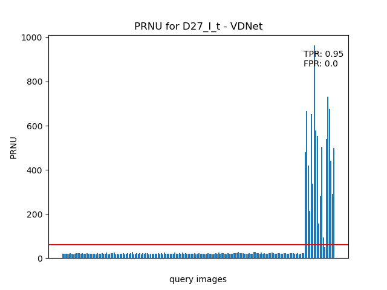

 


# Overview
As  explained  in  [5],  digital  images  and  video  continue  to replace  their  analog  counterparts,  the  importance  of  reliable, inexpensive  and  fast  identification  of  digital  image  origin will  only  increase.  Reliable  identification  of  the  device  used to  acquire  a  particular  digital  image  would  especially  prove useful, for example, in the court for establishing the origin of images presented as evidence.

This project is based on the work of [2], the goal is to extract sensor’s fingerprint from the captured image and compare this reference with other query  fingerprints in order to perform a camera identification task. As  suggested in [2], they use Photo-Response Non-Uniformity (**PRNU**) extracted from flat and  not  saturated images as a unique fingerprint of digitalcamera and use Peak-correlation-to-correlation-ratio (**PCE**) for the identification task. We use different algorithms in order to extract and compare digital camera fingerprints. In this report we extend the implementation provided in [2] by adding 2 new noise extraction methods: **VDNet**[1] and **VDID**[3]. 

# VDNet
VDNet uses a variational inference for non-iid real-noise estimation and image denoising in a unique Bayesian Network. Specifically, an approximate posterior, parameterized by deep neural networks, is presented by taking the intrinsic clean image and noise variances as latent variables conditioned on the input noisy image.

# VDID
Variational Deep Image Denoise (VDID) is a bayesian framework that can handle blind scenarios based on the variational approximation of objective functions separating the complicated problem into simpler ones.
Its main characteristics are:
- It handles **both AWGN and real-world noise**
- Trained in an end-to-end scheme without any additional noise information
- Requires fewer parameters than state-of-the-art denoisers
    
The objective is formulated in terms of **maximum a posterior** (MAP) inference. An approximated form of the objective is calculated by introducing a latent variable based on variational Bayes which incorporates the underlying noisy image distribution.
Based on the latent space, VDID can focus on simpler subdistributions of the original problem.

# Dataset
For the experiments we used the **VISION dataset** providedby LESC laboratory [4]. It contains about 30 devices and for each device there are flat and not saturated images from which the reference fingerprints are extracted. Each of them is then compared with 20 natural image query fingerprints from all other devices.

# Repository structure
The respository is structured as follows:
- ```example.py``` is the script used to test and evaluate the PCE.
- The ```plots/``` directory contains bar plots for each device showing PRNU, TPR and FPR values. This folder is divided in 3 subdirectories, one for each denoiser. Each subdirectory has one bar plot for each device.
- ```prnu/``` contains the noise extraction functions (original, VDNet and VDID).
- ```test/``` will contain your dataset: flat images must be placed in the ```ff/``` subdirectory and query images in ```nat/``` subdirectory.

```
.
├── example.py
├── plots
│   ├── original
│   │   ├── D08_I_t_.png
│   │   ├── ...
│   ├── vdid
│   │   ├── D08_I_t_.png
│   │   ├── ...
│   └── vdnet
│       ├── D08_I_t_.png
│       ├── ...
├── prnu
│   ├── functions.py
│   ├── VDIR
│   │   └── ...
│   └── VDNet
│       └── ...
├── README.md
├── requirements.txt
└── test
    ├── data
    │   ├── ff
    │   │   ├── D08_I_t_0011.jpg
    │   │   ├── ...
    │   └── nat
    │       ├── D08_I_t_0062.jpg
    │       ├── ...
    └── test_prnu.py


```

## Installation

```
git clone https://github.com/daikon899/PRNU
cd PRNU
pip3 install -r requirements.txt
```

## Usage
Run ```example.py``` to evaluate the PCE

```
python3 example.py
```

Compute PCE
```
usage: example.py [-h] [-denoiser DENOISER] [-rm_zero_mean] [-rm_wiener]

This program extracts camera fingerprint using VDNet and VDID and compares
them with the original implementation

optional arguments:
  -h, --help          show this help message and exit
  -denoiser DENOISER  [original (default) | vdnet | vdid]
  -rm_zero_mean       Removes zero mean normalization
  -rm_wiener          Removes Wiener filter

```

## Example
### 
- Following this example you will get the PCE using VDNet as noise extractor and without Wiener filter (zero mean normalization will be used).
```
python3 example.py -denoiser vdnet -rm_wiener
```
#### Output
In ```plots/``` folder there will be a ```VDNet/``` subdirectory with bar plots showing TPR's values for each device:
<p float="left" align="center">
  
</p>


# Project Documents
- For a detailed description of the experiments and results obtained refer to the [report](/docs/report.pdf).
- Project [presentation](/docs/final_presentation.pdf)
- And also the VDID and VDNet [presentation](/docs/presentation.pdf)


# Tools and Techniques
The main tools used in this work:
- VDID: a bayesian framework for denoising that can handle blind scenarios.
- VDNet: uses a variational inference for non-iid  real-noise estimation and image denoising in a unique Bayesian Network.
- PyCharm is an integrated development environment used in computer programming, specifically for the Python language [6].
- Computers:
    - Operating System: Ubuntu 20.04.2 LTS
    - CPU:  Intel(R) Core(TM) i9-7940X CPU @ 3.10GHz
    - GPU: one Nvidia Quadro P6000 with 24GB and four GeForce RTX 2080 with 12GB each.
    - RAM: 128GB.

# Bibliography
\[1\] https://github.com/zsyOAOA/VDNet

\[2\] http://dde.binghamton.edu/download/camera_fingerprin.

\[3\] https://github.com/JWSoh/VDIR

\[4\] https://lesc.dinfo.unifi.it/

\[5\] Jessica   Fridrich   Jan   Lukas   and   Miroslav   Goljan. "[Digital Camera Identification From Sensor Pattern Noise](http://ws2.binghamton.edu/fridrich/Research/double.pdf)", in: *IEEE TRANSACTIONS ON INFORMATION FORENSICS AND SECURITY* In 2006.

\[6\] https://www.jetbrains.com/pycharm/


# Acknowledgments
Elaborazione e Protezione delle Immagini - Computer Engineering Master Degree @[University of Florence](https://www.unifi.it/changelang-eng.html)
